# E-Mall

E-Mall 是一个 Go + Vue 的平台型电商商城项目，目标是把买家、商家、平台运营、订单履约、资金结算和基础中间件串成一条可演进的商业闭环。它不是单纯的后端接口 Demo，而是包含用户端商城、管理后台、卖家中心、资金流水、秒杀、通知和多语言能力的全栈项目。

当前代码处于 Post-P1 阶段：主链路已经覆盖商品浏览、下单支付、商家入驻、商品审核、订单履约、退款、结算、提现、平台佣金收益和运营后台。真实第三方支付、可靠消息 outbox、分布式补偿和生产级风控仍属于后续阶段。

## 技术栈

| 模块          | 技术                                                                               |
| ------------- | ---------------------------------------------------------------------------------- |
| Backend       | Go 1.26.2, Gin, GORM, MySQL, Redis                                                 |
| User Web      | Vue 3, TypeScript, Vite, Element Plus, Pinia, Vue Router, Axios, vue-i18n          |
| Admin Web     | Vue 3, TypeScript, Vite, Element Plus, Pinia, Vue Router, Axios, ECharts, vue-i18n |
| Search & MQ   | Elasticsearch, RabbitMQ, Kafka                                                     |
| Observability | Jaeger, SkyWalking                                                                 |
| DevOps        | Docker Compose                                                                     |

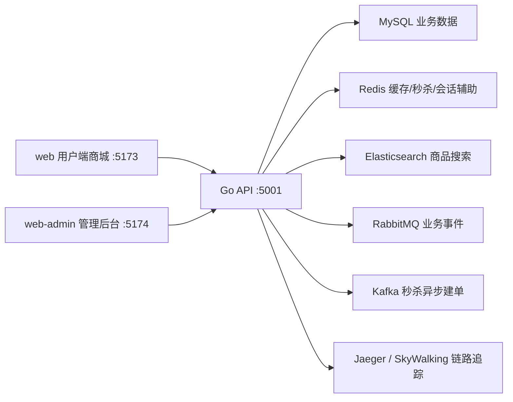

## 功能介绍

以下截图来自本地开发环境，使用真实后端、真实测试账号和本地商品图片生成。

### 商城首页与商品浏览


首页展示轮播图、商品分类、秒杀入口和热门商品。商品图片来自后端静态资源，商品卡片包含价格、划线价、卖家信息等商城基础信息。

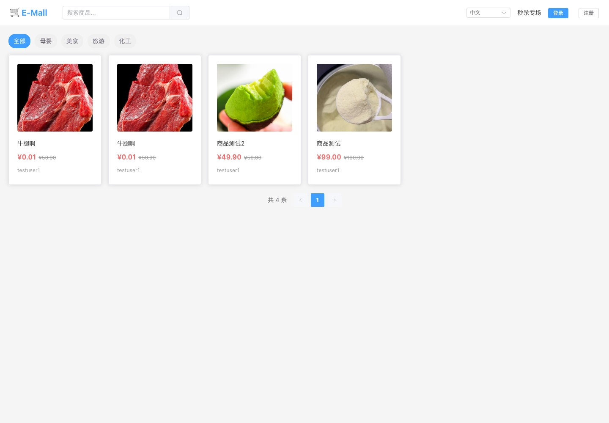

商品链路支持分类筛选、列表分页、商品详情、上下架状态、商品审核状态和 Elasticsearch 搜索接入。用户端已经接入 zh-CN / en-US 国际化，语言选择会影响导航、业务按钮、表单和 Element Plus 组件文案。

### 下单、订单与钱包

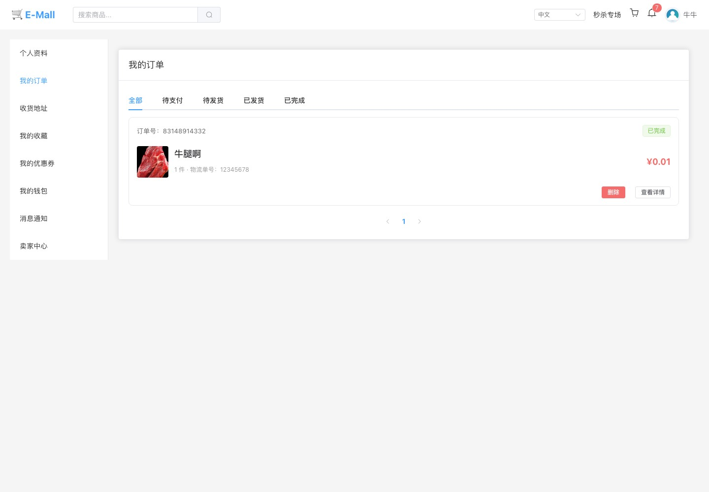

订单链路覆盖下单、支付、发货、确认收货、退款申请和订单状态流转。订单列表按照全部、待支付、待发货、已发货、已完成等状态组织，便于买家查看履约进度。

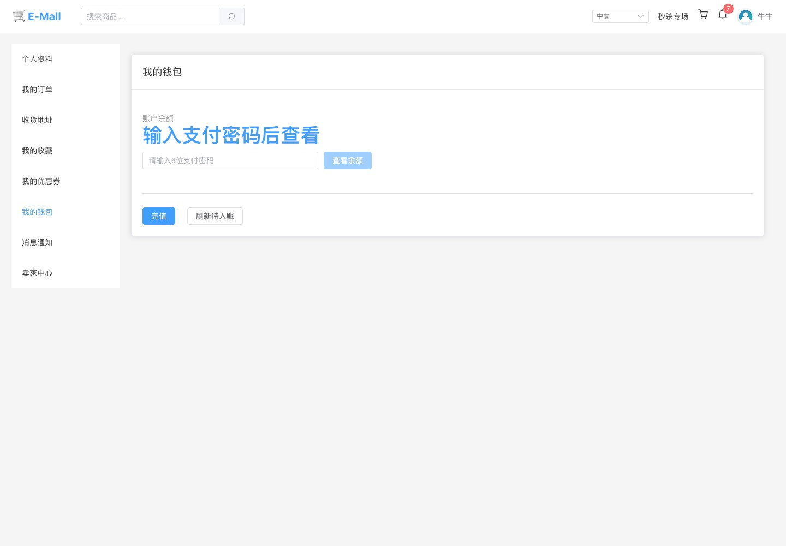

钱包页支持支付密码保护、余额查看、充值和待入账刷新。支付密码不在注册时设置，而是在钱包页独立设置和校验。

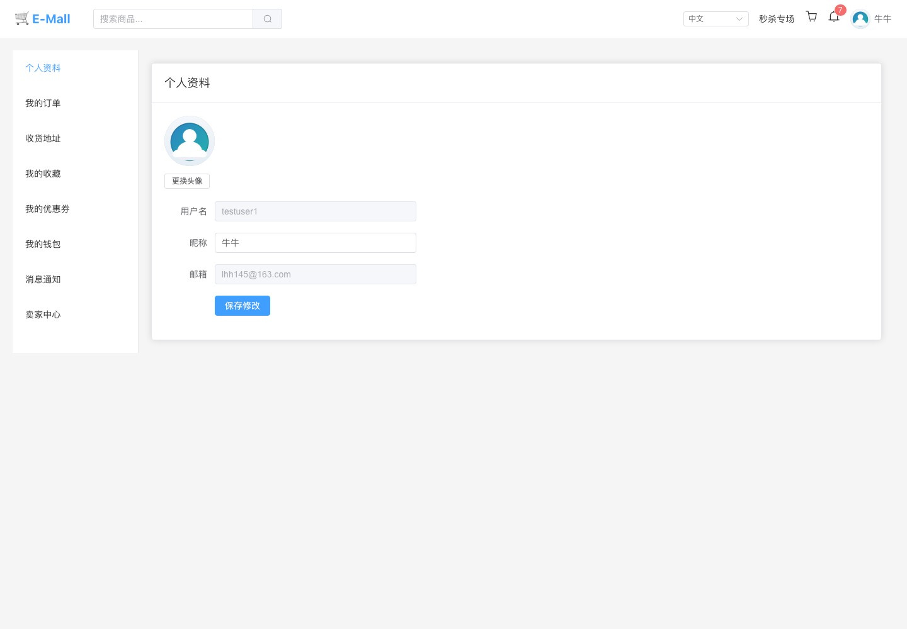

用户中心包含个人资料、头像、订单、地址、收藏、优惠券、钱包、消息通知和卖家中心入口。登录态通过前端 session 工具和 Pinia store 协作管理，请求统一携带 token、刷新 token 和语言请求头。

### 秒杀专场

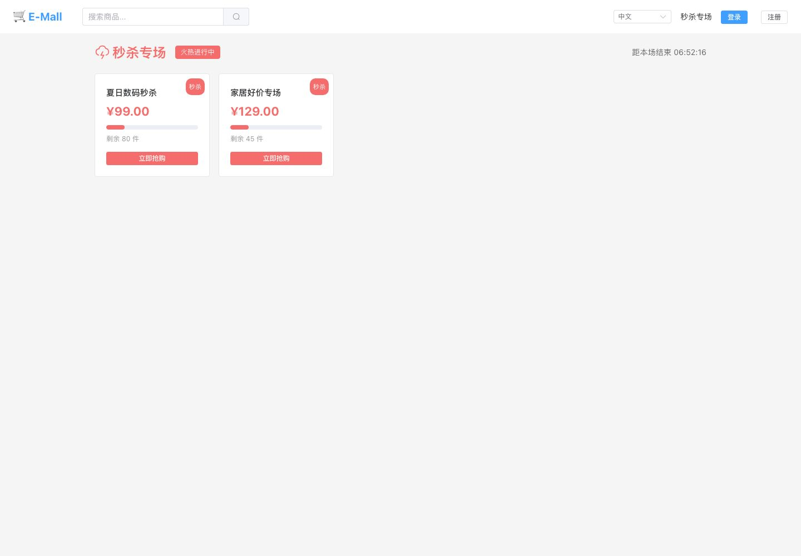

秒杀模块包含活动列表、库存展示、防重复下单、Redis Lua 预减库存和 Kafka 异步建单基础能力。秒杀下单结果查询、削峰容量和风控策略可以在后续生产级阶段继续扩展。

### 卖家中心与提现

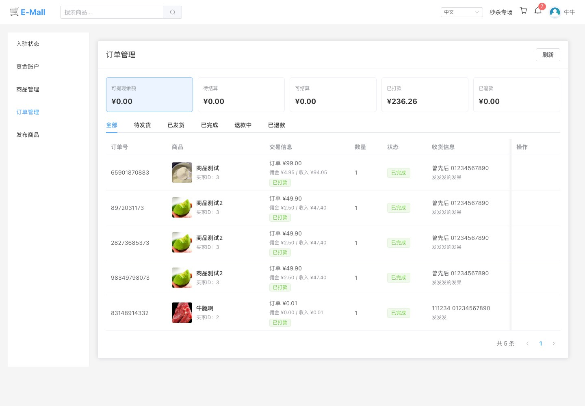

卖家中心覆盖商家入驻申请、审核状态查看、商品发布、商品管理、订单处理和履约发货。账号体系是统一用户体系，用户通过商家入驻获得卖家能力，而不是注册时区分买家/卖家。

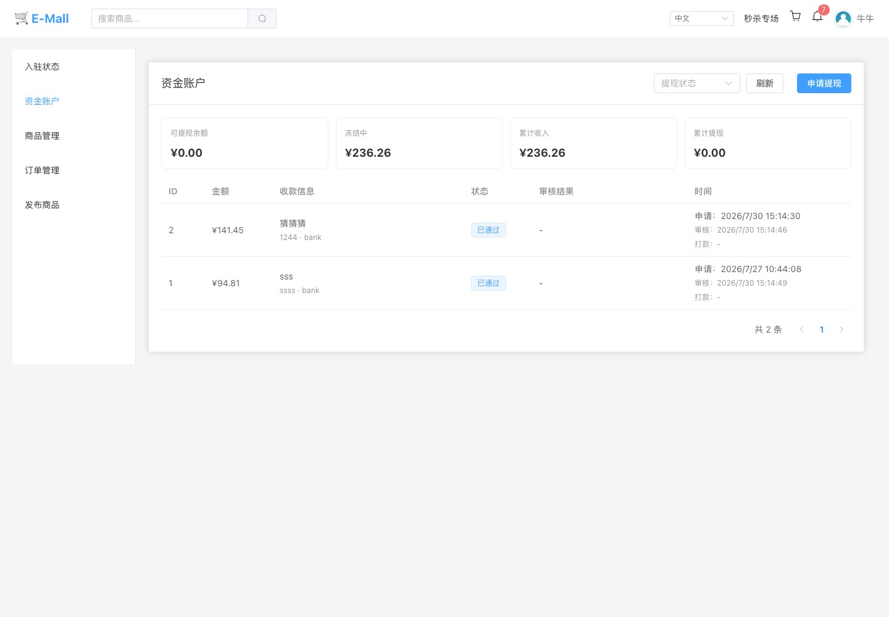

商家资金账户展示可提现余额、冻结中、累计收入和累计提现，并列出提现申请记录。订单结算、退款和提现都会写入资金流水，便于追踪金额来源和状态。

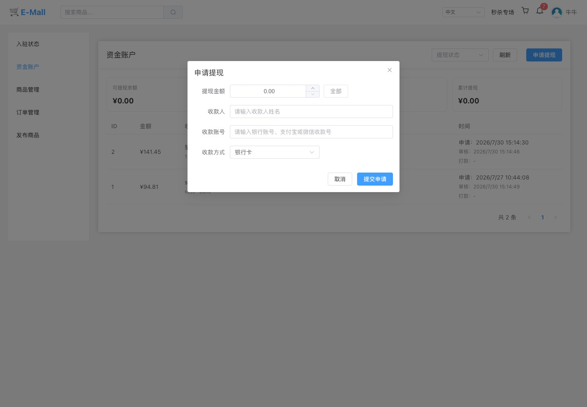

提现申请支持全部金额快捷填充，收款方式使用下拉选择。提现提交后进入后台审核、打款、失败等状态流转。

### 管理后台运营

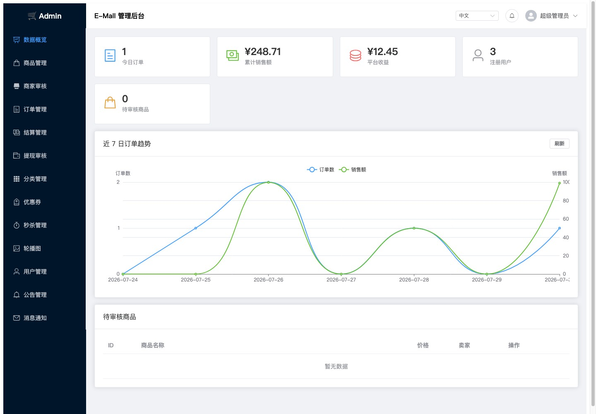

管理后台提供运营仪表盘、近 7 日订单趋势、平台收益、注册用户、待审核商品等统计视图。后台菜单会展示待处理数量，例如待审核商家、待审核商品、待处理退款、待打款结算和待审核提现。

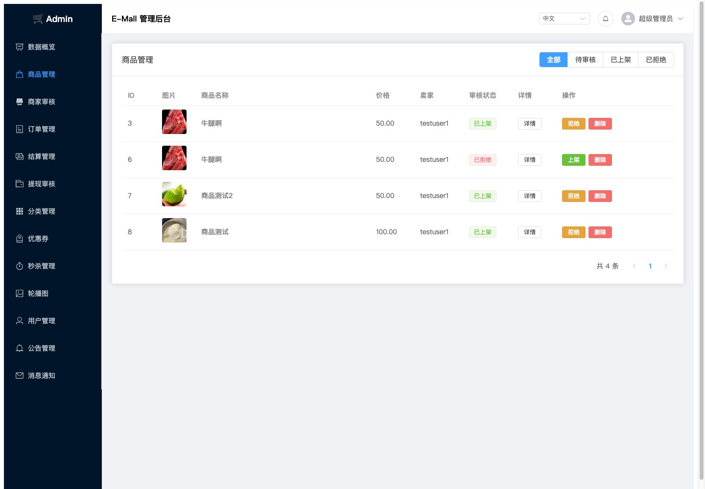

商品管理支持按全部、待审核、已上架、已拒绝筛选，管理员可以查看详情、拒绝、上架或删除商品。

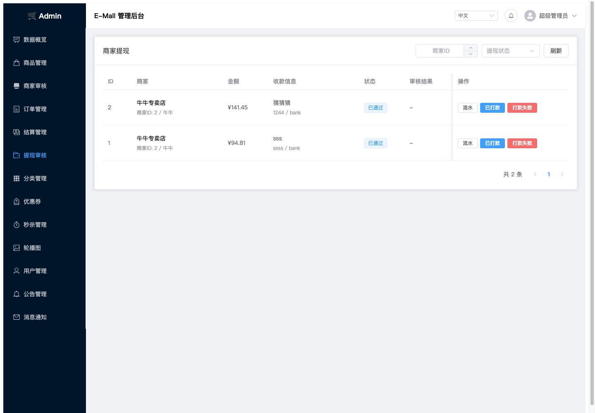

提现审核展示商家、金额、收款信息、状态、审核结果和操作入口，支持查看流水、审核通过、标记打款和打款失败。

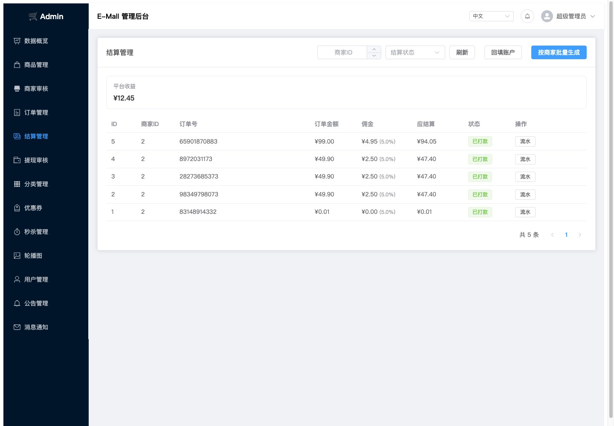

结算管理覆盖待结算、已生成、已打款、已退款等状态。平台佣金收益、商家结算金额和打款状态都可以通过后台和资金流水追踪。

### 通知与多账号

通知系统包含数据库通知、未读数量接口、SSE 未读变更推送和轮询回退。用户端和后台均支持多账号保存，并使用 tab 级 active session 隔离，方便在不同标签页使用不同账号做联调。

## 项目结构

```text
.
├── api/v1/                 Gin Handler
├── application/            跨模块用例编排和事务边界
├── cmd/                    程序入口
├── config/                 配置、SQL 初始化脚本
├── consts/                 业务常量
├── domain/                 领域事件、通知 hub 等领域能力
├── middleware/             JWT、CORS、Tracing
├── repository/             MySQL DAO、Redis、ES、RabbitMQ、Kafka
├── routes/                 路由注册
├── service/                单模块业务服务
├── types/                  请求/响应类型
├── web/                    用户端商城
└── web-admin/              管理后台
```

## Quick Start

### 1. 准备环境

建议使用：

- Go 1.26.2 或当前 `go.mod` 指定版本
- Node.js 22+
- Docker Desktop / Docker Compose
- MySQL 客户端可选，用于本地排查数据

### 2. 启动依赖

最小依赖：

```bash
docker compose up -d mysql redis rabbitmq kafka
```

完整开发依赖：

```bash
docker compose up -d mysql redis rabbitmq kafka elasticsearch kibana jaeger
```

如需 SkyWalking：

```bash
docker compose up -d skywalking-oap skywalking-ui
```

### 3. 启动后端

确认本地配置文件中的端口和账号指向 Docker Compose 暴露的服务，例如 MySQL `127.0.0.1:3307`、Redis `127.0.0.1:6379`、RabbitMQ `localhost:5672`、Kafka `localhost:9092`、Elasticsearch `127.0.0.1:9200`。

```bash
go mod download
cd cmd
go run main.go
```

默认后端地址：

```text
http://localhost:5001
```

开发环境默认管理员账号在本地配置中定义，当前为：

```text
admin / admin123456
```

本地演示账号：

```text
买家/卖家账号：testuser1 / 123456
买家账号：testuser2 / 123456
管理员账号：admin / admin123456
```

### 4. 启动用户端

```bash
cd web
npm install
npm run dev
```

默认地址：

```text
http://localhost:5173
```

### 5. 启动管理后台

```bash
cd web-admin
npm install
npm run dev
```

默认地址：

```text
http://localhost:5174
```

两个前端项目都会把 `/api/v1` 代理到 `http://localhost:5001`。

## Docker 配置

| 服务           | 端口                | 用途                          | 说明                                              |
| -------------- | ------------------- | ----------------------------- | ------------------------------------------------- |
| mysql          | `3307 -> 3306`      | 主业务数据库                  | 初始化 SQL 来自 `config/sql/`，数据库名 `mall_db` |
| redis          | `6379`              | 缓存、秒杀库存、防重复标记    | 默认开启密码，数据挂载到 `data/redis`             |
| rabbitmq       | `5672`, `15672`     | 业务事件、支付/通知等消息链路 | `15672` 是管理界面                                |
| kafka          | `9092`              | 秒杀异步建单                  | KRaft 单节点开发配置                              |
| elasticsearch  | `9200`              | 商品搜索                      | `xpack.security.enabled=false`                    |
| kibana         | `5601`              | ES 调试界面                   | 依赖 Elasticsearch                                |
| jaeger         | `16686`, `6831/udp` | 链路追踪                      | `16686` 是 UI                                     |
| skywalking-oap | `11800`, `12800`    | SkyWalking OAP                | 依赖 Elasticsearch                                |
| skywalking-ui  | `8080`              | SkyWalking UI                 | 依赖 OAP                                          |

常用 Docker 命令：

```bash
docker compose ps
docker compose logs -f mysql
docker compose logs -f redis
docker compose down
```

如果 Elasticsearch 启动遇到宿主机目录权限问题，检查 `docker-compose.yml` 中 `/usr/local/elasticsearch/...` 的宿主机挂载路径，按本机环境调整或授权。

## 前端环境变量

用户端和后台的公共展示配置在前端本地环境变量中维护，例如：

```text
VITE_APP_SITE_NAME=E-Mall
VITE_ADMIN_SITE_NAME=E-Mall 管理后台
VITE_APP_LOGO_TEXT=E-Mall
VITE_ADMIN_LOGO_TEXT=Admin
VITE_NOTIFICATION_SSE=true
VITE_NOTIFICATION_POLLING=true
VITE_NOTIFICATION_POLLING_INTERVAL_MS=30000
```

这些配置不再通过后端 public config 接口下发。后续如果支付方式、上传策略等需要与服务端能力同步，应新增语义更明确的 capabilities 接口。

## 验证命令

后端：

```bash
env GOCACHE=/private/tmp/e-mall-go-cache go test ./...
```

用户端：

```bash
cd web
npm run build
```

管理后台：

```bash
cd web-admin
npm run build
```

Post-P1 前端验收脚本：

```bash
node --experimental-strip-types --test web/tests/post-p1-acceptance.test.mjs
```

## 当前限制

- 真实微信/支付宝生产支付、证书管理、回调验签和支付补偿属于后续支付闭环阶段。
- 当前轻量事件总线是进程内同步发布，不等价于可靠 outbox 或分布式消息最终一致方案。
- Docker Compose 主要负责启动依赖服务，后端和两个前端默认仍在本机直接运行。
- 本地配置可能包含开发账号、SMTP、JWT 等敏感信息，提交前应确认 `.gitignore` 和 Git 跟踪状态。
